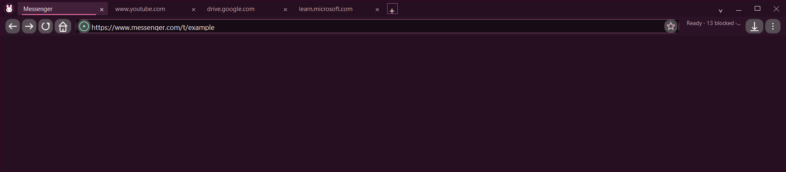

# MishaWeb

> [!WARNING]
> **Windows only. There is no macOS or Linux build, and one is not planned for the 2.x line.**
> MishaWeb is built on Windows Forms and the Microsoft Edge WebView2 Evergreen Runtime. Windows Forms has no macOS runtime, and WebView2 does not ship for macOS at all, so this project cannot be compiled or run on a Mac. A macOS edition would have to replace both the UI framework and the rendering engine, and would need a separate ad-blocking implementation built on WebKit's content-rule format rather than the ABP/uBO syntax this engine compiles.

A lightweight Windows desktop browser shell in C# (.NET 10 LTS WinForms) hosting Microsoft Edge WebView2 Evergreen, featuring custom ad blocking, tab memory management, CRX extension loading, and local address suggestions.

[](https://github.com/MishaelOliva/MishaWeb/actions/workflows/windows.yml)
[](https://github.com/MishaelOliva/MishaWeb)
[](https://dotnet.microsoft.com/download/dotnet/10.0)
[](LICENSE)



## What it does

- **Web browsing via WebView2**: Embeds the Microsoft Edge WebView2 Evergreen Runtime to render HTML5, CSS, and WebAssembly with hardware acceleration without bundling a full Chromium distribution.
- **Ad and tracker blocking**: Compiles filter rules from 20 catalog sources (including EasyList and EasyPrivacy formats) into an in-memory index for network request cancellation and document-start CSS element hiding.
- **Tab lifecycle management**: Uses a 3-tier memory policy (active and MRU resident set, low-memory background targets, and idle tab discard) to limit memory growth during extended browsing sessions.
- **Extension support**: Ingests CRX3, CRX2, and unpacked ZIP extensions with manifest permission auditing and isolated storage.
- **Local address suggestions**: Indexes typed history, bookmarks, and search terms locally with low allocation overhead (832 bytes per query in a 500-entry benchmark).

## Architecture / How it works

MishaWeb separates the desktop user interface and background subsystems from the browser rendering engine:

```
+-------------------------------------------------------------+
|                     MISHAWEB DESKTOP HOST                   |
|                 (C# 14 / .NET 10 LTS WinForms)              |
+-------------------------------------------------------------+
       |                                     |
       v                                     v
+-----------------------------+   +---------------------------+
|      NATIVE WINFORMS UI     |   |   CORE SUBSYSTEMS (C#)    |
| - Double-buffered GDI+ tab  |   | - AdBlockEngine           |
|   strip & command bar       |   | - TabLifecyclePolicy      |
| - Extensions manager dialog |   | - AddressSuggestionEngine |
| - Native start page         |   | - BrowserExtensions (CRX) |
+-----------------------------+   +---------------------------+
       |                                     |
       +----------------------+--------------+
                              |
                              v
       +---------------------------------------------+
       |      MICROSOFT EDGE WEBVIEW2 EVERGREEN      |
       | - CoreWebView2 Environment & Profiles       |
       | - Standard profile vs InPrivate UDF         |
       | - Resource requested network filtering      |
       | - Document-start stylesheet injection       |
       +---------------------------------------------+
```

Instead of packaging Chromium and Node.js binaries (like Electron), MishaWeb relies on the OS-installed Edge WebView2 runtime. This produces a compact 3.67 MB framework-dependent executable footprint.

## Quick start

### Prerequisites

- Windows 10 or Windows 11 (x64). There is no other supported operating system.
- [.NET 10.0 SDK](https://dotnet.microsoft.com/download/dotnet/10.0) (10.0.103+ pinned in `global.json`)
- [Microsoft Edge WebView2 Runtime](https://developer.microsoft.com/en-us/microsoft-edge/webview2/) (pre-installed on modern Windows)

### Build and Run from Source

```powershell
git clone https://github.com/MishaelOliva/MishaWeb.git
cd MishaWeb

# Restore dependencies
dotnet restore desktop.tests/MishaWeb.SmokeTests.csproj --locked-mode

# Run the desktop application
dotnet run --project desktop/MishaWeb.csproj --configuration Release
```

## Configuration

| Setting / Shortcut | Description | Default Location |
| :--- | :--- | :--- |
| Standard Profile | Stores cookies, cache, bookmarks, and local history | `%LOCALAPPDATA%\MishaWeb\User Data` |
| InPrivate Mode (`Ctrl+Shift+N`) | Opens an ephemeral window with isolated storage | Temporary directory, deleted on close |
| Extension Storage | Unpacked extension payloads and manifests | `%LOCALAPPDATA%\MishaWeb\Extensions` |
| Filter Catalog | Compiled rule cache for AdBlockEngine | `%LOCALAPPDATA%\MishaWeb\AdBlock` |

## Testing

The automated test suite runs via a custom console test runner in `desktop.tests/Program.cs`. It reports its own check count on completion, so run it for the current number. It covers filter rule compilation, YouTube ad-player runtime behavior, tab suspension logic, COM detachment safety, and suggestion index bounds:

```powershell
dotnet run --project desktop.tests/MishaWeb.SmokeTests.csproj --configuration Release
```

Release builds are verified with `-warnaserror` across all projects.

## Known limitations

- **Windows only**: Built on Windows Forms and Microsoft Edge WebView2; cannot run on macOS or Linux. See the warning at the top of this file for what a macOS edition would require.
- **Runtime dependency**: Requires Microsoft Edge WebView2 Evergreen Runtime present on the system.
- **Ad blocker scope**: Network filtering intercepts requests exposed through WebView2 APIs, and cosmetic filtering injects CSS rules at document start. It does not execute arbitrary procedural scriptlet injection.
- **Ad blocker response rewrites**: Rules carrying `$redirect=`, `$redirect-rule=`, `$empty`, `$mp4`, `$all` and `$priority=` are dropped rather than applied. A rewrite has no meaning in an engine that cancels requests, and honouring one as a block would turn a pixel swap into a broken image. Those requests are therefore *not* blocked, and the rule's protection is lost.

## License

This project is licensed under the [MIT License](LICENSE). Third-party library notices and upstream filter list licenses are documented in [`licenses/THIRD-PARTY-NOTICES.txt`](licenses/THIRD-PARTY-NOTICES.txt).

---
*Built by [Mishael Oliva](https://github.com/MishaelOliva) • [LinkedIn](https://www.linkedin.com/in/mishael-oliva-96a31b3a2)*
